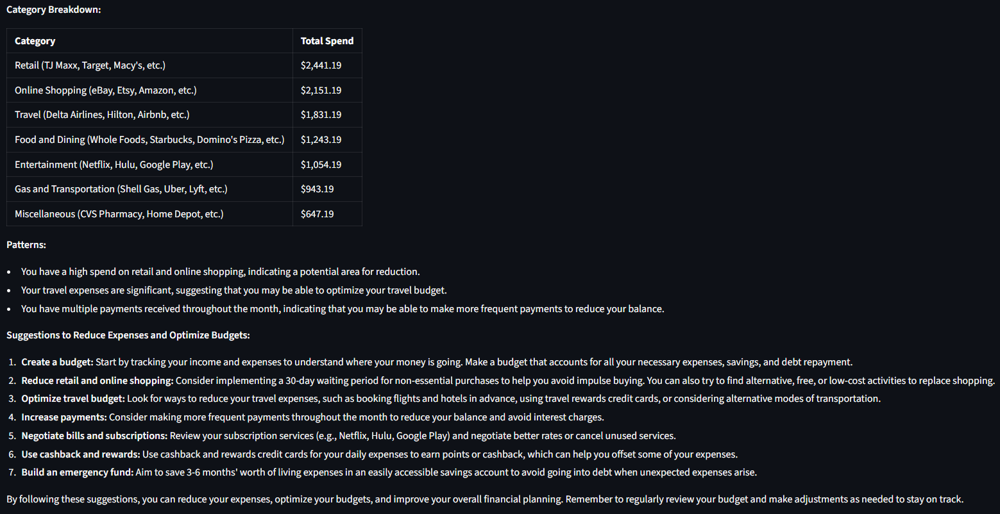
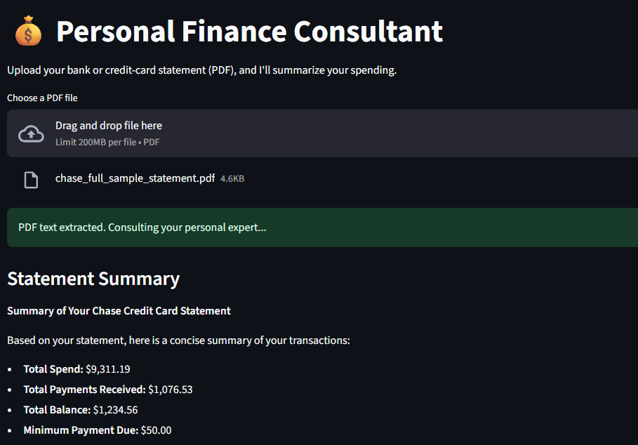

𝐓𝐡𝐞𝐲 𝐬𝐚𝐲 𝐆𝐞𝐧 𝐙 𝐢𝐬 “𝐯𝐢𝐛𝐢𝐧𝐠” 𝐭𝐡𝐞𝐢𝐫 𝐰𝐚𝐲 𝐢𝐧𝐭𝐨 𝐚𝐝𝐮𝐥𝐭𝐡𝐨𝐨𝐝. Our generation is cooked when it comes to personal finances and keeping track of their spending. Currently, the mainstream apps require you to add each of your expenses individually, or connect to your financial institution account, to give you a basic categorization of your expenses. This is either too inconvenient, or it doesn’t really help much. This is a problem that I was personally struggling with. 

I had been working with LLMs for some time, and this seemed to be a fitting application. So here I have built an app using the Meta-Llama model, which not only categorizes but also highlights unhealthy financial habits and identifies patterns in my spending behavior that I would normally miss.  
This has actually helped me become more vigilant about how I manage my expenditure.

**🔗 App Link:** [https://personalfinance-suchit.streamlit.app/](https://personalfinance-suchit.streamlit.app/)

---

### 📸 Screenshots

 

